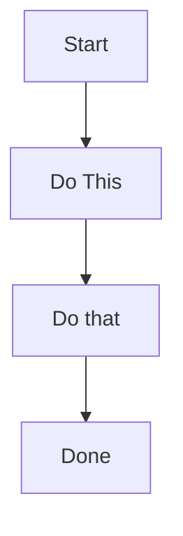
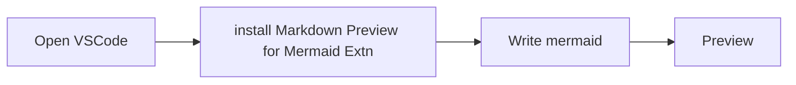
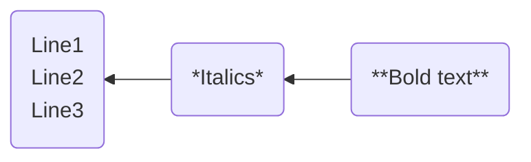
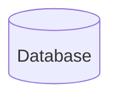
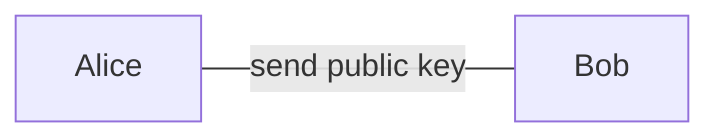
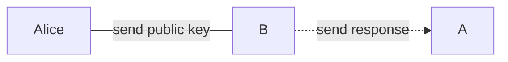
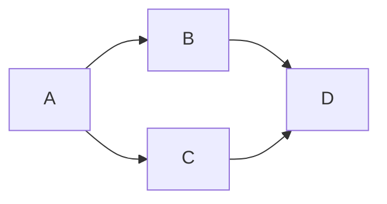
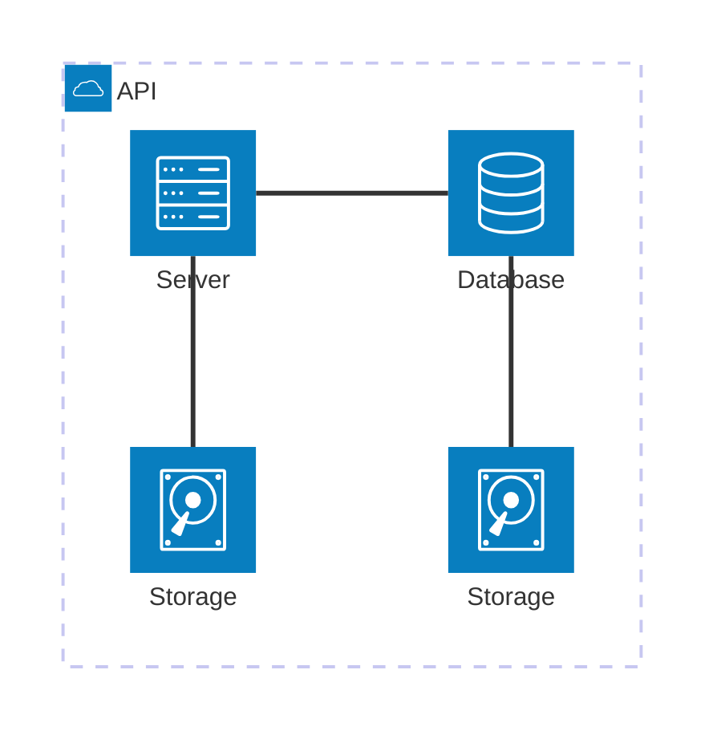
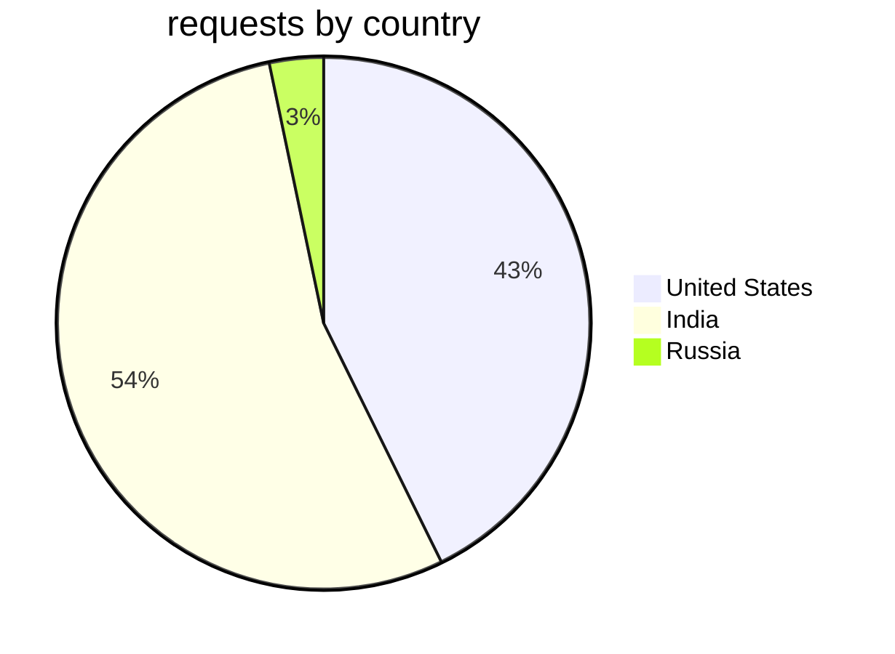

# Learning Mermaid

## Flowchart

### A top down flowchart

### Left-to-right flowchart

### Right-to-left flowchart

Also support markdown texts within the nodes

- codespan and strikethrough are not supported

- support many different shapes (hexagon, parallelogram, rhombus etc.)

### Linking nodes

This also works Use `-.` `.->` for dotted lines 

Linking multiple nodes

## Charts

### PieChart

