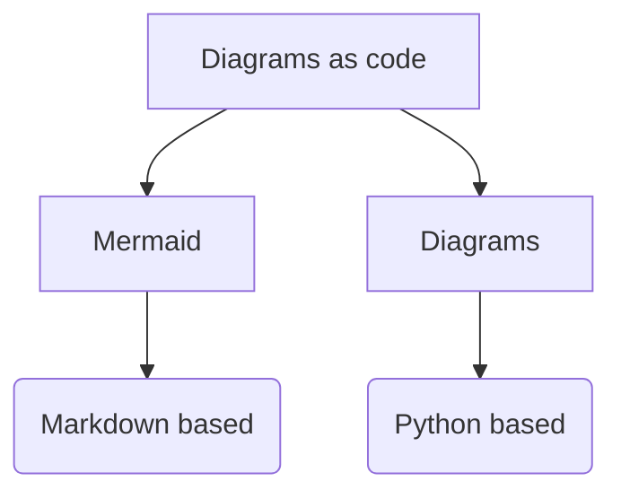

# What's happening in the gym?

## Things to try out

- [x] Nonblocking TCP client/server
- [-] Running zookeeper cluster locally with docker
- [x] poll
- [x] epoll
- [x] async IO
  - [x] basic signal handling
  - [x] handling SIGIO with sigaction
- [x] Connect to ubuntu VM from vscode using the remote-ssh extension
- [ ] Golang
  - [x] http get
  - [x] http post
  - [x] TLS Server
  - [x] functions
    - [x] variadic
    - [x] closures
    - [x] function types
  - [x] interfaces
    - [x] basics
    - [x] empty interfaces
    - [x] nil interfaces
    - [x] type assertions
  - [x] struct embedding
  - [x] channels
    - [x] basics
    - [x] read only and write only channels
  - [x] select
  - [x] atomic
    - [x] mutex
    - [x] Add/Load/Store
  - [x] environment variables
  - [ ] runes
  - [x] panic/recover
  - [x] strings
    - [x] strings package
    - [x] string formatting
    - [x] string builder
    - [x] string conversions
  - [x] cmdline processing
    - [x] functionality similar to argparse
  - [x] Files
    - [x] temp files
    - [x] directories
  - [x] defer
  - [x] log package
  - [x] init()
  - [x] timers
  - [x] tickers
  - [x] waitgroups
  - [ ] Language and other open source references for go topics
    - [ ] arrays
    - [ ] maps
    - [ ] make vs new
    - [x] embedding
    - [x] variadic functions
    - [x] interfaces
    - [x] tempfiles
    - [x] custom logging
- [ ] syslog, journalctl
- [x] gc pause
- [ ] json path
- [ ] ssl cert generator in go
- [ ] grpc
  - [x] basics
  - [x] protobuf basics
  - [ ] features
    - [x] keepalive
    - [x] authentication
    - [x] authorization
    - [x] debugging
    - [x] encryption
      - [x] tls
      - [x] mtls
    - [x] metadata
    - [x] interceptor
    - [x] metadata-interceptor
    - [x] multiplexing
    - [ ] compression
    - [x] reflection
    - [ ] health
    - [x] name resolving
    - [x] load balancing
    - [x] grpc-gateway
    - [x] grpcurl
    - [ ] openapi

## 2025

### Jan

- Created a snowflakeid app. tried to run it in my docker

spin up mongo

```bash
docker run -p 27017:27017 -d --name mongo --hostname mongo mongo:latest --replSet rs0
```

intialize replicaset

```javascript
rs.initiate({ _id: "rs0", members: [ { _id: 0, host: "mongo:27017" } ] })
```

run snowflakeid app

```console
✗ docker run --link mongo --name snowflakeidgen --rm snowflakeidgen
Generated and inserted 10000 IDs.
```

learnt that we can use `--link` option to link two containers, without having to create a new custom network between them.

next:

- set up a docker compose to spin up multiple apps

added docker compose file to spin up mongo and apps.

## Daily log - attempt3

## Day 10 - Deploying a kafka cluster locally on minikube

Following the instructions from [this page](https://www.strangeleaflet.com/blog/running-kafka-locally-in-kubernetes-using-minikube), installed helm and installed a kafka cluster. kafka service and pods were up. But the client had some trouble connecting to the service due to authentication issues.

```console
➜  ~ helm install my-kafka bitnami/kafka 
NAME: my-kafka
LAST DEPLOYED: Sun Oct 13 14:58:04 2024 
NAMESPACE: default                                                             
STATUS: deployed                                                                                                                                               REVISION: 1                                                                                                                                                    
TEST SUITE: None        
NOTES:
CHART NAME: kafka
CHART VERSION: 30.1.5              
APP VERSION: 3.8.0                                                             
                                                                               
** Please be patient while the chart is being deployed **
                                       
Kafka can be accessed by consumers via port 9092 on the following DNS name from within your cluster:
                                                                                                                                                                   my-kafka.default.svc.cluster.local                                         
                                       
Each Kafka broker can be accessed by producers via port 9092 on the following DNS name(s) from within your cluster:
                                       
    my-kafka-controller-0.my-kafka-controller-headless.default.svc.cluster.local:9092
    my-kafka-controller-1.my-kafka-controller-headless.default.svc.cluster.local:9092
    my-kafka-controller-2.my-kafka-controller-headless.default.svc.cluster.local:9092

The CLIENT listener for Kafka client connections from within your cluster have been configured with the following security settings:
    - SASL authentication

To connect a client to your Kafka, you need to create the 'client.properties' configuration files with the content below:

security.protocol=SASL_PLAINTEXT
sasl.mechanism=SCRAM-SHA-256
sasl.jaas.config=org.apache.kafka.common.security.scram.ScramLoginModule required \
    username="user1" \
    password="$(kubectl get secret my-kafka-user-passwords --namespace default -o jsonpath='{.data.client-passwords}' | base64 -d | cut -d , -f 1)";

To create a pod that you can use as a Kafka client run the following commands:

    kubectl run my-kafka-client --restart='Never' --image docker.io/bitnami/kafka:3.8.0-debian-12-r5 --namespace default --command -- sleep infinity
    kubectl cp --namespace default /path/to/client.properties my-kafka-client:/tmp/client.properties
    kubectl exec --tty -i my-kafka-client --namespace default -- bash

    PRODUCER:
        kafka-console-producer.sh \
            --producer.config /tmp/client.properties \
            --broker-list my-kafka-controller-0.my-kafka-controller-headless.default.svc.cluster.local:9092,my-kafka-controller-1.my-kafka-controller-headless.
default.svc.cluster.local:9092,my-kafka-controller-2.my-kafka-controller-headless.default.svc.cluster.local:9092 \
            --topic test

    CONSUMER:
        kafka-console-consumer.sh \
            --consumer.config /tmp/client.properties \
            --bootstrap-server my-kafka.default.svc.cluster.local:9092 \
            --topic test \
            --from-beginning

WARNING: There are "resources" sections in the chart not set. Using "resourcesPreset" is not recommended for production. For production installations, please s
et the following values according to your workload needs:
  - controller.resources
+info https://kubernetes.io/docs/concepts/configuration/manage-resources-containers/    
```

authentication failures from the client.

```console
[2024-10-13 19:06:13,180] WARN [Producer clientId=console-producer] Bootstrap broker my-kafka-controller-2.my-kafka-controller-headless.default.svc.cluster.local:9092 (id: -3 rack: null) disconnected (org.apache.kafka.clients.NetworkClient)
[2024-10-13 19:06:13,705] ERROR [Producer clientId=console-producer] Connection to node -2 (my-kafka-controller-1.my-kafka-controller-headless.default.svc.cluster.local/10.244.0.40:9092) failed authentication due to: Authentication failed during authentication due to invalid credentials with SASL mechanism SCRAM-SHA-256 (org.apache.kafka.clients.NetworkClient)
[2024-10-13 19:06:13,705] WARN [Producer clientId=console-producer] Bootstrap broker my-kafka-controller-1.my-kafka-controller-headless.default.svc.cluster.local:9092 (id: -2 rack: null) disconnected (org.apache.kafka.clients.NetworkClient)
[2024-10-13 19:06:14,223] ERROR [Producer clientId=console-producer] Connection to node -1 (my-kafka-controller-0.my-kafka-controller-headless.default.svc.cluster.local/10.244.0.41:9092) failed authentication due to: Authentication failed during authentication due to invalid credentials with SASL mechanism SCRAM-SHA-256 (org.apache.kafka.clients.NetworkClient)
[2024-10-13 19:06:14,223] WARN [Producer clientId=console-producer] Bootstrap broker my-kafka-controller-0.my-kafka-controller-headless.default.svc.cluster.local:9092 (id: -1 rack: null) disconnected (org.apache.kafka.clients.NetworkClient)
```

## Day 9 - creating a 3 node mongodb replicaset, with 2 data and an arbiter (PSA architecture)

Created a 3 node replica set using this [spec file](../mongodb/k8s/mongo-multinode-replset.yaml)

Started the stateful set with three pods.

```console
✗ kubectl get pods -n mongodb-test-multinode
NAME        READY   STATUS    RESTARTS   AGE
mongodb-0   1/1     Running   0          13s
mongodb-1   1/1     Running   0          9s
mongodb-2   1/1     Running   0          6s
```

Created a replica set with 2 nodes.

```console
✗ kubectl exec -it mongodb-0 -n mongodb-test-multinode -- mongosh --eval 'rs.initiate({
_id: "rs0",
members: [
  {_id:0, host: "mongodb-0.mongodb:27017"},
  {_id:1, host: "mongodb-1.mongodb:27017"}
]
})'

rs0 [direct: secondary] test> const status = rs.status();

rs0 [direct: secondary] test> status.members.forEach(member => {
...   print(`Name: ${member.name}, State: ${member.stateStr}`);
... });
Name: mongodb-0.mongodb:27017, State: SECONDARY
Name: mongodb-1.mongodb:27017, State: PRIMARY
```

Adding the arbiter

```console
rs0 [direct: primary] test> db.adminCommand({
...   setDefaultRWConcern: 1,
...   defaultWriteConcern: { w: "majority", wtimeout: 0 }
... })
{
  defaultReadConcern: { level: 'local' },
  defaultWriteConcern: { w: 'majority', wtimeout: 0 },
  updateOpTime: Timestamp({ t: 1727458419, i: 1 }),
  updateWallClockTime: ISODate('2024-09-27T17:33:46.471Z'),
  defaultWriteConcernSource: 'global',
  defaultReadConcernSource: 'implicit',
  localUpdateWallClockTime: ISODate('2024-09-27T17:33:46.481Z'),
  ok: 1,
  '$clusterTime': {
    clusterTime: Timestamp({ t: 1727458426, i: 2 }),
    signature: {
      hash: Binary.createFromBase64('AAAAAAAAAAAAAAAAAAAAAAAAAAA=', 0),
      keyId: Long('0')
    }
  },
  operationTime: Timestamp({ t: 1727458426, i: 2 })
}
rs0 [direct: primary] test> rs.addArb('mongodb-2.mongodb:27017')
{
  ok: 1,
  '$clusterTime': {
    clusterTime: Timestamp({ t: 1727458432, i: 1 }),
    signature: {
      hash: Binary.createFromBase64('AAAAAAAAAAAAAAAAAAAAAAAAAAA=', 0),
      keyId: Long('0')
    }
  },
  operationTime: Timestamp({ t: 1727458432, i: 1 })
}

rs0 [direct: primary] test> const status = rs.status();

rs0 [direct: primary] test> status.members.forEach(member => {
...   print(`Name: ${member.name}, State: ${member.stateStr}`);
... });
Name: mongodb-0.mongodb:27017, State: SECONDARY
Name: mongodb-1.mongodb:27017, State: PRIMARY
Name: mongodb-2.mongodb:27017, State: ARBITER

```

While this worked good, having the writeConcern as `majority` can cause performance issues when the secondary node goes down. See [this page](https://www.mongodb.com/docs/v5.1/tutorial/mitigate-psa-performance-issues/#std-label-performance-issues-psa) and [this page](https://www.mongodb.com/docs/v5.1/tutorial/add-replica-set-arbiter/). So setting the default writeConcern to 1.

```console
rs0 [direct: primary] test> db.adminCommand({
... setDefaultRWConcern:1,
... defaultWriteConcern: { w: 1}
... })
{
  defaultReadConcern: { level: 'local' },
  defaultWriteConcern: { w: 1, wtimeout: 0 },
  updateOpTime: Timestamp({ t: 1727471057, i: 1 }),
  updateWallClockTime: ISODate('2024-09-27T21:04:26.965Z'),
  defaultWriteConcernSource: 'global',
  defaultReadConcernSource: 'implicit',
  localUpdateWallClockTime: ISODate('2024-09-27T21:04:26.967Z'),
  ok: 1,
  '$clusterTime': {
    clusterTime: Timestamp({ t: 1727471066, i: 1 }),
    signature: {
      hash: Binary.createFromBase64('AAAAAAAAAAAAAAAAAAAAAAAAAAA=', 0),
      keyId: Long('0')
    }
  },
  operationTime: Timestamp({ t: 1727471066, i: 1 })
}
rs0 [direct: primary] test> 

rs0 [direct: primary] test> rs.status().members.forEach(member => {
...   print(`Name: ${member.name}, State: ${member.stateStr}`);
... });
Name: mongodb-0.mongodb:27017, State: SECONDARY
Name: mongodb-1.mongodb:27017, State: PRIMARY
Name: mongodb-2.mongodb:27017, State: ARBITER

```

 'rs.initiate({
_id: "rs0",
members: [
  {_id:0, host: "mongodb-replicaset-0.mongodb-svc:27017"},
  {_id:1, host: "mongodb-replicaset-1.mongodb-svc:27017"}
]
})'

## Day 8 - creating a 3 node mongodb replicaset

Created a 3 pod replicaset using this [spec file](../mongodb/k8s/mongo-multinode-replset.yaml)

Initialized the replica set as below.

```console
✗ kubectl exec -it mongodb-0 -n mongodb-test-multinode -- mongosh --eval 'rs.initiate({
_id: "rs0",
members: [
  {_id:0, host: "mongodb-0.mongodb:27017"},
  {_id:1, host: "mongodb-1.mongodb:27017"},
  {_id:2, host: "mongodb-2.mongodb:27017"}
]
})'
{
  ok: 1,
  '$clusterTime': {
    clusterTime: Timestamp({ t: 1727457187, i: 1 }),
    signature: {
      hash: Binary.createFromBase64('AAAAAAAAAAAAAAAAAAAAAAAAAAA=', 0),
      keyId: Long('0')
    }
  },
  operationTime: Timestamp({ t: 1727457187, i: 1 })
}

rs0 [direct: primary] test> const status = rs.status();

rs0 [direct: primary] test> status.members.forEach(member => {
...   print(`Name: ${member.name}, State: ${member.stateStr}`);
... });
Name: mongodb-0.mongodb:27017, State: PRIMARY
Name: mongodb-1.mongodb:27017, State: SECONDARY
Name: mongodb-2.mongodb:27017, State: SECONDARY

rs0 [direct: primary] test> db.adminCommand({getDefaultRWConcern: 1})
{
  defaultReadConcern: { level: 'local' },
  defaultWriteConcern: { w: 'majority', wtimeout: 0 },
  defaultWriteConcernSource: 'implicit',
  defaultReadConcernSource: 'implicit',
  localUpdateWallClockTime: ISODate('2024-09-27T17:19:24.382Z'),
  ok: 1,
  '$clusterTime': {
    clusterTime: Timestamp({ t: 1727457558, i: 1 }),
    signature: {
      hash: Binary.createFromBase64('AAAAAAAAAAAAAAAAAAAAAAAAAAA=', 0),
      keyId: Long('0')
    }
  },
  operationTime: Timestamp({ t: 1727457558, i: 1 })
}
```

1. defaultReadConcern: { level: 'local' }

Read Concern: Determines the level of isolation for read operations. It specifies the consistency and isolation properties of the data being read.
level: 'local': This setting means that the query returns the instance’s most recent data. It does not guarantee that the data has been written to a majority of the replica set members (i.e., it could be rolled back). This is the default read concern level and is suitable for scenarios where eventual consistency is acceptable.

2. defaultWriteConcern: { w: 'majority', wtimeout: 0 }

Write Concern: Specifies the level of acknowledgment requested from MongoDB for write operations to return a success status.
w: 'majority': This ensures that write operations return successfully only after the data has been written to the majority of the nodes in the replica set, including the primary node. It provides a stronger consistency guarantee by ensuring that written data can be read by subsequent read operations (assuming the same or stronger read concern level). This setting helps prevent data loss by ensuring that more than one node has the data before considering the operation successful.
wtimeout: 0: Specifies the time limit, in milliseconds, for the write concern to be satisfied. A value of 0 means there is no time limit, so the write operation will wait indefinitely until the write concern is satisfied. This can be useful to ensure data durability but may lead to operations hanging if the requested write concern cannot be satisfied due to, for example, a network partition or downed nodes.


## Day 7 - using service, connecting to mongo from another pod

Created a job to spin a new client

```yaml
apiVersion: batch/v1
kind: Job
metadata:
  name: mongodb-list-databases
  namespace: mongodb-test
spec:
  template:
    spec:
      containers:
      - name: mongodb-client
        image: mongo
        command: ["mongosh", "mongodb://mongodb.mongodb-test.svc.cluster.local:27017", "--eval", "db.adminCommand('listDatabases')"]
      restartPolicy: Never
  backoffLimit: 4
```

- Applied the spec

```console
✗ kubectl apply -f mongo-client-job.yml
job.batch/mongodb-list-databases created
✗ kubectl get pods -n mongodb-test
NAME                           READY   STATUS    RESTARTS   AGE
mongodb-0                      1/1     Running   0          19m
mongodb-list-databases-rz9qt   1/1     Running   0          2s
✗ kubectl get pods -n mongodb-test
NAME                           READY   STATUS      RESTARTS   AGE
mongodb-0                      1/1     Running     0          19m
mongodb-list-databases-rz9qt   0/1     Completed   0          3s

```

Got the logs from the pod

```console
✗ kubectl logs mongodb-list-databases-rz9qt -n mongodb-test
{
  databases: [
    { name: 'admin', sizeOnDisk: Long('81920'), empty: false },
    { name: 'config', sizeOnDisk: Long('180224'), empty: false },
    { name: 'local', sizeOnDisk: Long('450560'), empty: false }
  ],
  totalSize: Long('712704'),
  totalSizeMb: Long('0'),
  ok: 1,
  '$clusterTime': {
    clusterTime: Timestamp({ t: 1727011778, i: 1 }),
    signature: {
      hash: Binary.createFromBase64('AAAAAAAAAAAAAAAAAAAAAAAAAAA=', 0),
      keyId: Long('0')
    }
  },
  operationTime: Timestamp({ t: 1727011778, i: 1 })
}
```

## Day 6 - mongodb in kubernetes using minikube

- Created a single node mongodb, with statically provisioned PV

```console
✗ kubectl apply -f mongo-single-node.yaml
persistentvolume/mongodb-pv created
persistentvolumeclaim/mongodb-pvc created
statefulset.apps/mongodb created
service/mongodb created

✗ kubectl get all,pv,pvc -n mongodb-test
NAME            READY   STATUS    RESTARTS   AGE
pod/mongodb-0   1/1     Running   0          29s

NAME              TYPE        CLUSTER-IP   EXTERNAL-IP   PORT(S)     AGE
service/mongodb   ClusterIP   None         <none>        27017/TCP   29s

NAME                       READY   AGE
statefulset.apps/mongodb   1/1     29s

NAME                          CAPACITY   ACCESS MODES   RECLAIM POLICY   STATUS   CLAIM                      STORAGECLASS   VOLUMEATTRIBUTESCLASS   REASON   AGE
persistentvolume/mongodb-pv   1Gi        RWO            Delete           Bound    mongodb-test/mongodb-pvc   standard       <unset>                          29s

NAME                                STATUS   VOLUME       CAPACITY   ACCESS MODES   STORAGECLASS   VOLUMEATTRIBUTESCLASS   AGE
persistentvolumeclaim/mongodb-pvc   Bound    mongodb-pv   1Gi        RWO            standard       <unset>                 29s

✗ kubectl exec -it mongodb-0 -n mongodb-test -- mongosh --eval "db.hello()"
{
  isWritablePrimary: true,
  topologyVersion: {
    processId: ObjectId('66f0154e4e630ac135628d18'),
    counter: Long('0')
  },
  maxBsonObjectSize: 16777216,
  maxMessageSizeBytes: 48000000,
  maxWriteBatchSize: 100000,
  localTime: ISODate('2024-09-22T13:04:22.028Z'),
  logicalSessionTimeoutMinutes: 30,
  connectionId: 10,
  minWireVersion: 0,
  maxWireVersion: 25,
  readOnly: false,
  ok: 1
}

✗ kubectl exec -it mongodb-0 -n mongodb-test -- mongosh
Current Mongosh Log ID: 66f0169d711c26d7cb1681ec
Connecting to:          mongodb://127.0.0.1:27017/?directConnection=true&serverSelectionTimeoutMS=2000&appName=mongosh+2.3.1
Using MongoDB:          8.0.0
Using Mongosh:          2.3.1

For mongosh info see: https://www.mongodb.com/docs/mongodb-shell/

test> show dbs
admin   40.00 KiB
config  60.00 KiB
local   40.00 KiB
test>
```

Deleted the resources

```console
✗ kubectl delete -f mongo-single-node.yaml
persistentvolume "mongodb-pv" deleted
persistentvolumeclaim "mongodb-pvc" deleted
statefulset.apps "mongodb" deleted
service "mongodb" deleted
✗ kubectl get all,pv,pvc -n mongodb-test
No resources found
```

- Created a single node replicaset, with dynamically provisioned PVCs.

```yaml
apiVersion: apps/v1
kind: StatefulSet
metadata:
  name: mongodb
  namespace: mongodb-test
spec:
  serviceName: mongodb
  replicas: 1
  selector:
    matchLabels:
      app: mongodb
  template:
    metadata:
      labels:
        app: mongodb
    spec:
      containers:
        - name: mongodb
          image: mongo
          ports:
            - containerPort: 27017
          command: ["mongod", "--replSet", "rs0", "--port", "27017", "--bind_ip_all"]
          volumeMounts:
            - name: mongodb-data
              mountPath: /data/db
  volumeClaimTemplates:
    - metadata:
        name: mongodb-data
      spec:
        accessModes:
          - ReadWriteOnce
        resources:
          requests:
            storage: 1Gi
        storageClassName: standard

---

apiVersion: v1
kind: Service
metadata:
  name: mongodb
  namespace: mongodb-test
spec:
  clusterIP: None
  selector:
    app: mongodb
  ports:
    - protocol: TCP
      port: 27017
      targetPort: 27017
```

Created the resources.

```console
✗ kubectl apply -f mongo-single-node-replset.yaml
statefulset.apps/mongodb created
service/mongodb created

✗ kubectl get all,pv,pvc -n mongodb-test
NAME            READY   STATUS    RESTARTS   AGE
pod/mongodb-0   1/1     Running   0          4s

NAME              TYPE        CLUSTER-IP   EXTERNAL-IP   PORT(S)     AGE
service/mongodb   ClusterIP   None         <none>        27017/TCP   4s

NAME                       READY   AGE
statefulset.apps/mongodb   1/1     4s

NAME                                                        CAPACITY   ACCESS MODES   RECLAIM POLICY   STATUS   CLAIM                                 STORAGECLASS   VOLUMEATTRIBUTESCLASS   REASON   AGE
persistentvolume/pvc-e8e0579f-ca8c-46f3-9c3d-097fffd7dd90   1Gi        RWO            Delete           Bound    mongodb-test/mongodb-data-mongodb-0   standard       <unset>                          4s

NAME                                           STATUS   VOLUME                                     CAPACITY   ACCESS MODES   STORAGECLASS   VOLUMEATTRIBUTESCLASS   AGE
persistentvolumeclaim/mongodb-data-mongodb-0   Bound    pvc-e8e0579f-ca8c-46f3-9c3d-097fffd7dd90   1Gi        RWO            standard       <unset>                 4s
```

PV and PVCs are dynamically provisioned with type `HostPath` by minikube

```console
 ✗ kubectl describe persistentvolume/pvc-e8e0579f-ca8c-46f3-9c3d-097fffd7dd90 -n mongodb-test
Name:            pvc-e8e0579f-ca8c-46f3-9c3d-097fffd7dd90
Labels:          <none>
Annotations:     hostPathProvisionerIdentity: 151ae896-829e-49bf-b1df-dd36d11ac073
                 pv.kubernetes.io/provisioned-by: k8s.io/minikube-hostpath
Finalizers:      [kubernetes.io/pv-protection]
StorageClass:    standard
Status:          Bound
Claim:           mongodb-test/mongodb-data-mongodb-0
Reclaim Policy:  Delete
Access Modes:    RWO
VolumeMode:      Filesystem
Capacity:        1Gi
Node Affinity:   <none>
Message:
Source:
    Type:          HostPath (bare host directory volume)
    Path:          /tmp/hostpath-provisioner/mongodb-test/mongodb-data-mongodb-0
    HostPathType:
Events:            <none>
```

Enabled port forward to reach the pod fro the local host

```console
 ✗ kubectl port-forward -n mongodb-test pod/mongodb-0 27017:27017
Forwarding from 127.0.0.1:27017 -> 27017
Forwarding from [::1]:27017 -> 27017

~ mongosh "mongodb://localhost:27017/?replicaSet=rs0" --eval "rs.conf()"
{
  _id: 'rs0',
  version: 1,
  term: 2,
  members: [
    {
      _id: 0,
      host: 'localhost:27017',
      arbiterOnly: false,
      buildIndexes: true,
      hidden: false,
      priority: 1,
      tags: {},
      secondaryDelaySecs: Long('0'),
      votes: 1
    }
  ],
  protocolVersion: Long('1'),
  writeConcernMajorityJournalDefault: true,
  settings: {
    chainingAllowed: true,
    heartbeatIntervalMillis: 2000,
    heartbeatTimeoutSecs: 10,
    electionTimeoutMillis: 10000,
    catchUpTimeoutMillis: -1,
    catchUpTakeoverDelayMillis: 30000,
    getLastErrorModes: {},
    getLastErrorDefaults: { w: 1, wtimeout: 0 },
    replicaSetId: ObjectId('66f014234d59d84420312be1')
  }
}
```

### Day 5 - tqdm module in python

Played around with tqdm in python. super quick way to show progress bar for an iterable processing.

### Day 4 - MongoDB replicaset

Played around with mongodb replica set single node and multi node setup using docker.

for the multi node setup, used a docker compose to spin up three mongo containers, connected by a bridge network with the following replica set config.

```javascript
rs.initiate({
  _id: "rs0",
  members: [
    { _id: 0, host: "mongo1:27017" },
    { _id: 1, host: "mongo2:27018" },
    { _id: 2, host: "mongo3:27019" }
  ]
});
```

Initialized the replicaset followed by composing the containers, used the command `docker compose -f mongodb-replicaset.yml up -d && sleep 5 && mongosh "mongodb:
//localhost:27017" < init-rs.js` with the replica set initiate command specified in init-rs.js

```console
 ✗ docker compose -f mongodb-replicaset.yml up -d && sleep 5 && mongosh "mongodb:
//localhost:27017" < init-rs.js
[+] Running 4/4
 ✔ Network mongo-cluster  Created                                                                   0.0s
 ✔ Container mongo1       Started                                                                   0.2s
 ✔ Container mongo2       Started                                                                   0.2s
 ✔ Container mongo3       Started                                                                   0.2s
Current Mongosh Log ID: 66e785fd6e4fbb68522a524b
Connecting to:          mongodb://localhost:27017/?directConnection=true&serverSelectionTimeoutMS=2000&ap
pName=mongosh+2.3.1
Using MongoDB:          7.0.14
Using Mongosh:          2.3.1
```

after editing the `/etc/hosts` file to account for mongo1, mongo2 and mongo3, able to reach the replicaset from the host using mongosh with the connection string `"mongodb://localhost:27017,localhost:27018,localhost:27019/?replicaSet=rs0"`

cleaned up the containers with `docker compose down`

```console
✗ docker compose -f mongodb-replicaset.yml down -v
[+] Running 4/4
 ✔ Container mongo1       Removed                                                                  10.3s
 ✔ Container mongo3       Removed                                                                  10.2s
 ✔ Container mongo2       Removed                                                                  10.2s
 ✔ Network mongo-cluster  Removed                                                                   0.1s
```

### Day 3 - Running mongodb with docker locally

Able to run a single node mongodb, single node replica set.

Tried to configure a 3 node replica set, so created a network and then created 3 containers. Followed by that, initialized the replicaset.

```console
docker network create mongo-cluster
docker run -d --name mongo1 --net mongo-cluster -p 27017:27017 mongodb/mongodb-community-server --replSet rs0
docker run -d --name mongo2 --net mongo-cluster -p 27018:27017 mongodb/mongodb-community-server --replSet rs0
docker run -d --name mongo3 --net mongo-cluster -p 27019:27017 mongodb/mongodb-community-server --replSet rs0

test> rs.initiate({
...   _id: "rs0",
...   members: [
...     { _id: 0, host: "mongo1:27017" },
...     { _id: 1, host: "mongo2:27017" },
...     { _id: 2, host: "mongo3:27017" }
...   ]
... })
{ ok: 1 }

rs0 [direct: secondary] test> rs.status()
{
  set: 'rs0',
  date: ISODate('2024-09-10T02:32:42.537Z'),
  myState: 2,
  term: Long('0'),
  syncSourceHost: '',
  syncSourceId: -1,
  heartbeatIntervalMillis: Long('2000'),
  majorityVoteCount: 2,
  writeMajorityCount: 2,
  votingMembersCount: 3,
  writableVotingMembersCount: 3,
  optimes: {
    lastCommittedOpTime: { ts: Timestamp({ t: 1725935555, i: 1 }), t: Long('-1') },
    lastCommittedWallTime: ISODate('2024-09-10T02:32:35.041Z'),
    readConcernMajorityOpTime: { ts: Timestamp({ t: 1725935555, i: 1 }), t: Long('-1') },
    appliedOpTime: { ts: Timestamp({ t: 1725935555, i: 1 }), t: Long('-1') },
    durableOpTime: { ts: Timestamp({ t: 1725935555, i: 1 }), t: Long('-1') },
    lastAppliedWallTime: ISODate('2024-09-10T02:32:35.041Z'),
    lastDurableWallTime: ISODate('2024-09-10T02:32:35.041Z')
  },
  lastStableRecoveryTimestamp: Timestamp({ t: 1725935555, i: 1 }),
  members: [
    {
      _id: 0,
      name: 'mongo1:27017',
      health: 1,
      state: 2,
      stateStr: 'SECONDARY',
      uptime: 96,
      optime: { ts: Timestamp({ t: 1725935555, i: 1 }), t: Long('-1') },
      optimeDate: ISODate('2024-09-10T02:32:35.000Z'),
      lastAppliedWallTime: ISODate('2024-09-10T02:32:35.041Z'),
      lastDurableWallTime: ISODate('2024-09-10T02:32:35.041Z'),
      syncSourceHost: '',
      syncSourceId: -1,
      infoMessage: '',
      configVersion: 1,
      configTerm: 0,
      self: true,
      lastHeartbeatMessage: ''
    },
    {
      _id: 1,
      name: 'mongo2:27017',
      health: 1,
      state: 2,
      stateStr: 'SECONDARY',
      uptime: 7,
      optime: { ts: Timestamp({ t: 1725935555, i: 1 }), t: Long('-1') },
      optimeDurable: { ts: Timestamp({ t: 1725935555, i: 1 }), t: Long('-1') },
      optimeDate: ISODate('2024-09-10T02:32:35.000Z'),
      optimeDurableDate: ISODate('2024-09-10T02:32:35.000Z'),
      lastAppliedWallTime: ISODate('2024-09-10T02:32:35.041Z'),
      lastDurableWallTime: ISODate('2024-09-10T02:32:35.041Z'),
      lastHeartbeat: ISODate('2024-09-10T02:32:42.116Z'),
      lastHeartbeatRecv: ISODate('2024-09-10T02:32:42.153Z'),
      pingMs: Long('2'),
      lastHeartbeatMessage: '',
      syncSourceHost: '',
      syncSourceId: -1,
      infoMessage: '',
      configVersion: 1,
      configTerm: 0
    },
    {
      _id: 2,
      name: 'mongo3:27017',
      health: 1,
      state: 2,
      stateStr: 'SECONDARY',
      uptime: 7,
      optime: { ts: Timestamp({ t: 1725935555, i: 1 }), t: Long('-1') },
      optimeDurable: { ts: Timestamp({ t: 1725935555, i: 1 }), t: Long('-1') },
      optimeDate: ISODate('2024-09-10T02:32:35.000Z'),
      optimeDurableDate: ISODate('2024-09-10T02:32:35.000Z'),
      lastAppliedWallTime: ISODate('2024-09-10T02:32:35.041Z'),
      lastDurableWallTime: ISODate('2024-09-10T02:32:35.041Z'),
      lastHeartbeat: ISODate('2024-09-10T02:32:42.115Z'),
      lastHeartbeatRecv: ISODate('2024-09-10T02:32:42.172Z'),
      pingMs: Long('1'),
      lastHeartbeatMessage: '',
      syncSourceHost: ''
      syncSourceId: -1,
      infoMessage: '',
      configVersion: 1,
      configTerm: 0
    }
  ],
  ok: 1,
  '$clusterTime': {
    clusterTime: Timestamp({ t: 1725935555, i: 1 }),
    signature: {
      hash: Binary.createFromBase64('AAAAAAAAAAAAAAAAAAAAAAAAAAA=', 0),
      keyId: Long('0')
    }
  },
  operationTime: Timestamp({ t: 1725935555, i: 1 })
}
```

Connecting to the mongodb instance using direct connection works `"mongodb://localhost:27017?directConnection=true"` but replica set didn't work.

Connecting to the replicaset from within the container works

```console
mongodb@06ccc5d7442d:/$ mongosh "mongodb://mongo1:27017,mongo2:27018,mongo3:27019/?replicaSet=rs0"
Current Mongosh Log ID: 66dfb670eceec36b27c76a8a
Connecting to:          mongodb://mongo1:27017,mongo2:27018,mongo3:27019/?replicaSet=rs0&appName=mongosh+2.3.0
Using MongoDB:          7.0.12
Using Mongosh:          2.3.0

For mongosh info see: https://www.mongodb.com/docs/mongodb-shell/

------
   The server generated these startup warnings when booting
   2024-09-10T02:42:05.464+00:00: Using the XFS filesystem is strongly recommended with the WiredTiger storage engine. See http://dochub.mongodb.org/core/prodnotes-filesystem
   2024-09-10T02:42:06.398+00:00: Access control is not enabled for the database. Read and write access to data and configuration is unrestricted
   2024-09-10T02:42:06.399+00:00: /sys/kernel/mm/transparent_hugepage/enabled is 'always'. We suggest setting it to 'never' in this binary version
   2024-09-10T02:42:06.399+00:00: vm.max_map_count is too low
------

rs0 [primary] test>
```

looks like I will need to use docker-compose and specify the below parameter.

```yaml
    extra_hosts:
      - "host.docker.internal:host-gateway"
```

The `extra_hosts` attribute in a Docker Compose file allows you to add additional hostnames to the container's `/etc/hosts` file.

The syntax for `extra_hosts` is as follows:

```yaml
extra_hosts:
    - hostname:IP
```

The `host.docker.internal:host-gateway` entry is a special value that allows the container to access the host machine's network stack. It resolves to the IP address of the Docker host from within a container.

Use cases for `extra_hosts` include:

1. Accessing services running on the host machine from within a container.
2. Connecting to databases or other services running on the host machine.
3. Testing and development scenarios where you need to simulate a network environment.

By adding `host.docker.internal:host-gateway` to `extra_hosts`, you can easily access services running on the host machine without having to hardcode IP addresses or modify the container's network configuration.

Found many references using this parameter

- https://anthonysimmon.com/the-only-local-mongodb-replica-set-with-docker-compose-guide-youll-ever-need/
- https://dev.to/abdelfattahradwan/quick-and-easy-mongodb-replica-set-deployment-with-docker-compose-1kij
- https://dev.to/arthurgermano/tutorial-configuring-a-local-mongodb-docker-replicaset-with-3nodes-and-tls-4492

will try with docker compose and corrected network configuration tomorrow.

### Day 2 - Diagrams as Code with Mermaid

Playing with [mermaid flowcharts](https://mermaid.js.org/syntax/flowchart.html)

Installed the extension for VS Code to render mermaid in preview



Tomorrow:

- [ ] Little more on systemctl and its alternatives
- [ ] Find resources to learn prompt engineering

### Day 1 - systemctl service

Playing around with turning a python script into a service running under systemctl.

- Created a simple scraper to scrap links in a given set of URLs.
- Created a new multipass ubuntu instance (been a long time I spun up one locally)
- Defined the service unit file
- Added the service file to systemd and reloaded the daemon

```console
$ cp scraper.service /etc/systemd/system/
cp: cannot create regular file '/etc/systemd/system/scraper.service': Permission denied
$ sudo !!
sudo cp scraper.service /etc/systemd/system/
$ sudo systemctl daemon-reload
$ sudo systemctl enable scraper.service
Created symlink /etc/systemd/system/multi-user.target.wants/scraper.service → /etc/systemd/system/scraper.service.
$ sudo systemctl status scraper.service
○ scraper.service - Continuous Scraper Service with Virtual Environment
     Loaded: loaded (/etc/systemd/system/scraper.service; enabled; preset: enabled)
     Active: inactive (dead)
```

Turns out that I attempted to start the service before installing the virtual environment and pip packages on the newly created ubuntu instance.

- Installed virtual environment - `sudo apt install python3.12-venv`
- Installed pip - `sudo apt install python3-pip`
- Tested the script first. Printed the links to stdout
- set the user passwd in the ubuntu instance (systemctl restart command asks for it. hence.)

```console
$ sudo systemctl status scraper.service
● scraper.service - Continuous Scraper Service with Virtual Environment
     Loaded: loaded (/etc/systemd/system/scraper.service; enabled; preset: enabled)
     Active: active (running) since Sat 2024-09-07 22:53:34 EDT; 10s ago
   Main PID: 4203 (python)
      Tasks: 1 (limit: 1060)
     Memory: 21.4M (peak: 21.8M)
        CPU: 234ms
     CGroup: /system.slice/scraper.service
             └─4203 python /home/ubuntu/Home/workspace/github/codegym/services/scraper/app.py

$ journalctl -u scraper.service
Sep 07 22:53:34 ubuntu-lts systemd[1]: Started scraper.service - Continuous Scraper Service with Virtual Environment.
Sep 07 22:54:35 ubuntu-lts bash[4203]: Scraping https://www.google.com
Sep 07 22:54:35 ubuntu-lts bash[4203]: https://www.google.com/imghp?hl=en&tab=wi
Sep 07 22:54:35 ubuntu-lts bash[4203]: https://maps.google.com/maps?hl=en&tab=wl
Sep 07 22:54:35 ubuntu-lts bash[4203]: https://play.google.com/?hl=en&tab=w8
Sep 07 22:54:35 ubuntu-lts bash[4203]: https://www.youtube.com/?tab=w1
Sep 07 22:54:35 ubuntu-lts bash[4203]: https://news.google.com/?tab=wn
Sep 07 22:54:35 ubuntu-lts bash[4203]: https://mail.google.com/mail/?tab=wm
Sep 07 22:54:35 ubuntu-lts bash[4203]: https://drive.google.com/?tab=wo
Sep 07 22:54:35 ubuntu-lts bash[4203]: https://www.google.com/intl/en/about/products?tab=wh
Sep 07 22:54:35 ubuntu-lts bash[4203]: http://www.google.com/history/optout?hl=en
Sep 07 22:54:35 ubuntu-lts bash[4203]: /preferences?hl=en
Sep 07 22:54:35 ubuntu-lts bash[4203]: https://accounts.google.com/ServiceLogin?hl=en&passive=true&continue=https://www.google.com/&ec=GAZAAQ
Sep 07 22:54:35 ubuntu-lts bash[4203]: /advanced_search?hl=en&authuser=0
Sep 07 22:54:35 ubuntu-lts bash[4203]: /intl/en/ads/
Sep 07 22:54:35 ubuntu-lts bash[4203]: /services/
Sep 07 22:54:35 ubuntu-lts bash[4203]: /intl/en/about.html
Sep 07 22:54:35 ubuntu-lts bash[4203]: /intl/en/policies/privacy/
Sep 07 22:54:35 ubuntu-lts bash[4203]: /intl/en/policies/terms/
Sep 07 22:54:35 ubuntu-lts bash[4203]: Scraping https://www.apple.com
Sep 07 22:54:35 ubuntu-lts bash[4203]: /
Sep 07 22:54:35 ubuntu-lts bash[4203]: /us/shop/goto/store
Sep 07 22:54:35 ubuntu-lts bash[4203]: /mac/
Sep 07 22:54:35 ubuntu-lts bash[4203]: /ipad/
Sep 07 22:54:35 ubuntu-lts bash[4203]: /iphone/
Sep 07 22:54:35 ubuntu-lts bash[4203]: /watch/
Sep 07 22:54:35 ubuntu-lts bash[4203]: /apple-vision-pro/
Sep 07 22:54:35 ubuntu-lts bash[4203]: /airpods/
Sep 07 22:54:35 ubuntu-lts bash[4203]: /tv-home/
```

- Tried to reference the app path through environment variable in the service unit file, but that doesn't seem to be possible. We can define the environment variables directly in the unit file or in a separate file (and refer to it with `EnvironmentFile` directive in the service file) for the service to use when it runs. However, the service file as such cannot refer it seems

## Daily log - attempt#2

Been a while I lost in touch with my daily exercise. Restarting the practice.

### Day 76 (running mynotesapp and tweetbot in gcf)

- Welcome June!
- Converted mynotesapp into a go function running in gcf
- Hooked up my tweetbot to pull the notes from mynotesapp
- Set up Cloud Scheduler to trigger my tweetbot on hourly cadence
- Things working, but need proper docs, code clean up etc. more on that later.

### Day 75 (no code)

### Day 74 (running gcp cloud event function)

- Cleaned up the code a little
- added a makefile for local and cloud deploy, and test script for testing

### Day 73 (running gcp cloud event function)

- trying out google cloud event function today
- source available [here](../go/gcp_cloud_function_cloud_event/)
- able to test with functions framework and sending pubsub message in a curl request

```console
 ✗ echo -n "Google" | base64
R29vZ2xl

curl localhost:8080 \
    -X POST \
    -H "Content-Type: application/json" \
    -H "ce-id: 123451234512345" \
    -H "ce-specversion: 1.0" \
    -H "ce-time: 2020-01-02T12:34:56.789Z" \
    -H "ce-type: google.cloud.pubsub.topic.v1.messagePublished" \
    -H "ce-source: //pubsub.googleapis.com/projects/MY-PROJECT/topics/MY-TOPIC" \
    -d '{
        "message": {
            "data": "R29vZ2xl",
            "attributes": {
                "attr1":"attr1-value"
            }
        },
        "subscription": "projects/MY-PROJECT/subscriptions/MY-SUB"
    }'
```

- on the server side,

```console
✗ export FUNCTION_TARGET=helloPubSubHandler
✗ go run cmd/main.go
2023/05/30 12:26:59 Hello Google!
2023/05/30 12:27:12 Hello world!
```

- need to test with a emulator

### Day 72 (running a go function in google cloud function)

- Updated the go function to handle multiple entry points
- Deployed it with Functions Framework and in the cloud
- Updated the Makefile to handle local and cloud deployment
- will try out cloud_event trigger tomorrow

### Day 71 (running a go function in google cloud function)

- reading about Google Cloud Functions in Go
- followed the instructions from [here](https://cloud.google.com/functions/docs/create-deploy-gcloud#functions-deploy-command-go) to deploy a sample function
- [directory structure](https://cloud.google.com/functions/docs/writing#directory-structure-go) for a go function in google cloud function
- tested the function locally with [functions-framework](https://github.com/GoogleCloudPlatform/functions-framework-go) and also deployed it in cloud

```console
✗ curl https://go-http-function-nxxo6p55tq-uc.a.run.app
Hello World!%
```

### Day 70 (adding a go webapp for my notes)

- Getting started with a simple go webapp for my notes
- added few endpoints and corresponding handlers
- need to convert my notes into the new format

### Day 69 (generating openapi spec, go-swagger)

- Exploring swagger and openapi spec for the notes app
- added a sample spec and generated the server code using go-swagger
- seems like a overkill for the usecase I am targeting

### Day 68 (google cloud function with cloud pubsub)

- Don't know if the file encoding was messed up during zipping or copying. The null byte error continued to bite me
- Deploying the function via `gcloud` CLI resolved the problem. and made the process much easier too
- able to trigger the function via pubsub and have the note tweeted
- added detailed notes in my other tweetbot repo
- Used **gcloud functions deploy** command to deploy. Specify the deployment region, runtime (e.g. python39, python311 etc.), and the entrypoint to the function. Optionally specify the trigger as well.
- Set up the pubsub topic separately, and specified its name in the `--trigger-topic` option
- Environment variables can be specified separately via `--set-env-vars FOO=bar` option or through yaml file using `--env-vars-file .env.yaml` option.
- Need to use structured logging to filter the logs by level

### Day 67 (setting my own google cloud function)

Bummer! While all worked good locally, cloud build failed with a weird error in main.py. `Step #1 - "build": Sorry: ValueError: source code string cannot contain null bytes`

used a python code to find null bytes in the source, but it didn't turn up any.

```python
def find_null_bytes(filename):
    with open(filename, 'rb') as file:
        content = file.read()
        null_positions = [i for i, byte in enumerate(content) if byte == b'\x00']
        return null_positions

# Usage
filename = 'main.py'
null_positions = find_null_bytes(filename)
print("Null byte positions:", null_positions)
```

Tried to re-edit the file inline, but that also didn't work. Text encoding is also in utf-8 as well. Stack overflow searches were also not fruitful.

will debug it tomorrow.

### Day 66 (exploring cloud functions and eventarc triggers)

- Wanted to set up a Cloud Function with a trigger that fires the function every x hours or so.
- there doesn't seem to be a direct way to do that. Explored around Cloud Scheduler, but haven't found a way yet. may be I haven't looked deep enough
- Set up a Cloud Function with an EventArc Trigger, and connected to Cloud Pub/Sub messagePublished event
  - As part of that, created a new topic on the Cloud Pub Sub
  - wanted to see if the function is triggered each time a message is published on the topic
  - went to the Cloud Pub Sub page, under Messages, manually published a message
  - then came back to the Cloud Functions page of the function I just created. able to see the logs logged during each invocation
- If I don't find a way to directly trigger the cloud function from cloud scheduler, then will set up a cloud schduler to publish a message to the pub-sub topic every x hours and have it trigger the cloud function

### Day 65 (creating a twitter bot with v2 API, exploring cloud functions)

- Tried to create a twitter bot using Twitter V2 API and Tweepy
- Able to send a tweet using v2 API
- Explored the documentation of Google Cloud Functions. Supports both http and cloud event based invocations
- Installed functions_framework from pip, and tested the cloud-event based functions locally

### Day 64 (reading about Twitter API v2)

- Trying to setup a twitter bot using v2 API
- Some resources related to that
  - [About Oauth 2.0 authorization code](https://developer.twitter.com/en/docs/authentication/oauth-2-0/authorization-code)
  - [Twitter Tutorial on v2 API](https://developer.twitter.com/en/docs/tutorials/creating-a-twitter-bot-with-python--oauth-2-0--and-v2-of-the-twi)
  - Set up the credentials and used [Tweepy](https://docs.tweepy.org/en/latest/api.html#tweepy.Client.create_tweet) to send a tweet using v2 API. Hides the complexity of all the auth and token stuff pretty much.

### Day 63 (no code)

### Day 62 (no code)

### Day 61 (no code)

### Day 60 (no code)

### Day 59 (learning rust - primitives)

- Going through [primitives](https://doc.rust-lang.org/stable/rust-by-example/primitives.html)

### Day 58 (learning rust - hello world)

- Exploring rust...just for some fun.

### Day 55-57 (no code)

### Day 54 (reading grpc compression, health check and retry)

- went through grpc compression, retry and health check functionalities
- both retry and health check uses service config
- taking on compression first. client and server must register the same compressor
- client can choose to same compression for all calls or per call using CallOptions
- Package [gzip](https://github.com/grpc/grpc-go/blob/v1.55.0/encoding/gzip/gzip.go) implements and register a gzip compressor
- gzip's `init()` registers the compressor using `encoding.RegisterCompressor`, which adds the compressor to `registeredCompressor` map. grpc server and client code gets the registered compressor through `GetCompressor` when invoking the registered RPCs.

```go
func init() {
	c := &compressor{}
	c.poolCompressor.New = func() interface{} {
		return &writer{Writer: gzip.NewWriter(io.Discard), pool: &c.poolCompressor}
	}
	encoding.RegisterCompressor(c)
}
```

- On the server side, not much to do except to register the compressor. Importing gzip package takes care of registering the gzip compressor through its init function.
- On the client side, we can use custom compressor or use gzip
  - To configure gzip compressor for all calls on the connection, use `grpc.WithDefaultCallOptions(grpc.UseCompressor(gzip.Name))`

    ```go
    conn, err := grpc.Dial(*addr,
            grpc.WithTransportCredentials(insecure.NewCredentials()),
            grpc.WithDefaultCallOptions(grpc.UseCompressor(gzip.Name)))
    ```

  - To configure gzip compressor per call, use `grpc.UseCompressor(gzip.Name)` in the call options

```go
	resp, err := client.UnaryEcho(ctx, &pb.EchoRequest{Message: msg}, grpc.UseCompressor(gzip.Name))
```

### Day 53 (nocode)

### Day 52 (nocode)

### Day 51 (grpc mutual TLS client)

- added the client side code for mTLS client
- fixed the certificate issue on the server side. had the wrong CA configured on the server

### Day 50 (grpc mutual TLS)

- Yay, day 50 successfully. Started with gRPC basics on day 1, ~50 days ago.
- read about configuring client and server with mutual TLS
- configured a server with mutual TLS
- will add a client with mutual TLS tomorrow

### Day 49 (go runtime package, filepath)

- fixed the ssl cert path import issue. defined sslcerts as a separate package
- used `runtime.Caller` to get the path to the file (think it is identical to using `__file__`), which inspects the stack frame return the neccessary info.
- updated the tls examples to get the path to certs from the `sslcerts.Path`

```go
pc, currentFilePath, lineno, ok := runtime.Caller(0 /* number of the stack frames to ascend */)
```

### Day 48 (grpc static authentication with PerRPCCredentials)

- added an example for static authentication with username and password using metadata and PerRPCCredentials
- [x] need to fix the ssl cert path import

### Day 47 (grpc static authentication)

- Fixed the errors in passing auth info in metadata
- able to pass username, password in metadata and validate on the server side
- need to use PerRPCCredentials next

### Day 46 (grpc static authentication)

- adding an example for static authentication with username and password
- used a unary interceptor on the server side to extract the username and password from metadata
- username/password based authentication is not a recommended way, but just wanted to test it out
- running into some error in adding the metadata on the client side. my previous example on the client side interceptor also seem to have a bug. metadata added to grpc.Header through call options is not showing up on the server side
- [x] Use [PerRPCCredentials](https://pkg.go.dev/google.golang.org/grpc@v1.54.0/credentials#PerRPCCredentials) to provide the authentication
- [x] Fix the errors in authentication_static and client interceptor

### Day 45 (grpc authentication in etcd)

- found examples of the authentication usage in etcd client and server
- client sends the auth token using PerRPCCredentials, configured using a [token bundle](https://github.com/etcd-io/etcd/blob/7462c61b31ab6df81391cc567ac7162a89ff911f/client/v3/client.go#L296). Token bundle is from [credentials](credentials.Bundle)
- server side uses a unary interceptor, get the [authorization](https://github.com/etcd-io/etcd/blob/7462c61b31ab6df81391cc567ac7162a89ff911f/api/v3rpc/rpctypes/metadatafields.go#L19) from metadata (extracted [here](https://github.com/etcd-io/etcd/blob/7462c61b31ab6df81391cc567ac7162a89ff911f/server/auth/store.go#L1054)), pass to a [token provider](https://github.com/etcd-io/etcd/blob/7462c61b31ab6df81391cc567ac7162a89ff911f/server/auth/store.go#L1110)

### Day 44 (grpc authentication with oauth2)

- Added an example for Oauth2 authentication
- Client can choose authenticate per call or per rpc (using `grpc.WithPerRPCCredentials` that takes a token source)
  - Get the token source via **oauth.TokenSource**, using a `oauth**.TokenSource{TokenSource: oauth2.StaticTokenSource(getToken())}` for this example
- Auth token is sent in the format of **Bearer <auth-token>** in the metadata
- For the unary call, server side intercepts it with an UnaryInterceptor, extracts the auth token from the metadata and validates it before invoking the rpc
- [x] need to checkout how it is used in a realtime application

### Day 43 (grpc authentication client side tls)

- added authentication of server cert from client side
- didn't know what COMMON_NAME field is deprecated. Ran into the below error

```console
err=rpc error: code = Unavailable desc = connection error: desc = "transport: authentication handshake failed: tls: failed to verify certificate: x509: certificate relies on legacy Common Name field, use SANs instead"
exit status 1
```

- Then tried to update my own script to add SAN. Realized that I had to specify the SAN in both CSR and certificate create request

```bash
# To create csr
openssl req -new -nodes -newkey rsa:2048 \
    -subj "/C=US/ST=DE/O=Example-server, Inc./CN=localhost" \
    -addext "subjectAltName = DNS:localhost, IP:127.0.0.1" \
    -out server.csr -keyout server.key

# To create a req signed by root-ca
openssl x509 -req -sha256 -days 1000 \
    -in server.csr -CA ca_cert.crt \
    -extfile <(printf "subjectAltName=DNS:localhost,IP:127.0.0.1") \
    -CAkey ca_cert.key -CAcreateserial -out server.crt
```

- That also didn't work as the root-ca wasn't signed properly.

```console
err=rpc error: code = Unavailable desc = connection error: desc = "transport: authentication handshake failed: tls: failed to verify certificate: x509: certificate signed by unknown authority (possibly because of \"crypto/rsa: verification error\" while trying to verify candidate authority certificate \"examplerootca.org\")"
```

- Ended up using the [script](https://github.com/grpc/grpc-go/blob/e853dbf004c343da4b8c6204524765ba6fbeef38/examples/data/x509/create.sh) that came with grpc-go itself

### Day 42 (grpc authentication)

- Wanted to enable Oauth2 authentication to a client-server example.
- authentication can be set per connection or per RPCs.
- required tls in the underlying transport. so tried to set up a tls server to start off with.

```console
✗ openssl s_client -showcerts -connect localhost:50505
CONNECTED(00000005)
depth=0 C = US, ST = DE, O = "Example-server, Inc.", CN = localhost
verify error:num=20:unable to get local issuer certificate
verify return:1
depth=0 C = US, ST = DE, O = "Example-server, Inc.", CN = localhost
verify error:num=21:unable to verify the first certificate
verify return:1
write W BLOCK
---
Certificate chain
 0 s:/C=US/ST=DE/O=Example-server, Inc./CN=localhost
   i:/C=US/ST=DE/O=ExampleRootCA, Inc./CN=examplerootca.org
-----BEGIN CERTIFICATE-----
```

- many things to follow up
  - [-] update ssl-cert-gen to parse arguments via getopt and add an option to take target dir.
  - [-] if not the above, update ssl-cert-gen to take target-dir via environment variable to keep this simple. Create another script in go to generate ssl certs
  - [-] make sslcerts as a separate module and get the path to certs and keys from there // dropped this for now
  - [x] add a client that uses tls in the connection to the server

### Day 41 (grpc debugging logs)

- Just playing with debugging, reading [the docs](https://github.com/grpc/grpc-go/blob/master/Documentation/log_levels.md)
- Enable additonal logging by setting the verbosity and severity levels
- supported severity are - **Info**, **Warning**, **Error** and **Fatal**
- supported verbosity levels 0..4 built in.

### Day 40 (grpc load balancing)

- updated server with option to run multiple server instances
- updated client to make multiple Unary RPC calls
- added notes capturing my understanding

### Day 39 (grpc load balancing)

- reading through load balancing policy
- added a sample client code. need to follow up with some doubts that I had while working on the code
  - [x] Verify that the client is using the round robin load balancing policy. - yes, but sometimes connection state could impact the ordering.
  - [x] Check if we can get the resolved address from the client connection. - can see from the debug logs
  - [x] Add notes for the load balancing feature
  - [x] Check what other load balancing policies are available.

### Day 38 (break)

### Day 37 (grpc-gateway)

- Updated the Reminder service with grpc-gateway, using [these steps](https://github.com/grpc-ecosystem/grpc-gateway) and [tutorial](https://grpc-ecosystem.github.io/grpc-gateway/docs/tutorials/adding_annotations/#using-protoc)
- updated tools to bring in the dependencies, followed the instructions from [here](https://github.com/go-modules-by-example/index/blob/master/010_tools/README.md)
- added a Makefile to build proto, server and client
- Sample invocations

```console
➜  examples git:(april-2023) ✗ curl --request POST -d '{"what":"Buy something","when":"2022-04-13T15:30:00Z","type":"PUSH"}' http://localhost:8080/v1/reminders
{"success":true, "id":1}%
➜  examples git:(april-2023) ✗ curl --request POST -d '{"what":"drop off package","when":"2022-04-13T14:30:00Z","type":"PUSH"}' http://localhost:8080/v1/reminders
{"success":true, "id":2}%
➜  examples git:(april-2023) ✗ curl --request GET http://localhost:8080/v1/reminders | jq
% Total    % Received % Xferd  Average Speed   Time    Time     Time  Current
                                Dload  Upload   Total   Spent    Left  Speed
100   161  100   161    0     0  36400      0 --:--:-- --:--:-- --:--:--  157k
{
"reminders": [
    {
    "what": "Buy something",
    "when": "2022-04-13T15:30:00Z",
    "type": "PUSH"
    },
    {
    "what": "drop off package",
    "when": "2022-04-13T14:30:00Z",
    "type": "PUSH"
    }
]
}
```

### Day 36 (grpc name-resolver)

- Moved resolver into own package
- revisited the Builder and Resolver, and the UpdateState
- added comments
- next
  - [ ] current example for name resolving makes only one call. why the features in grpc-go makes multiple calls?
  - [ ] Check the sample invocations in etcd client

### Day 35 (grpc name-resolver)

- Good workout on the name resolving. found examples in etcd client. understood the resolver part, yet to explore more on the load balancing part
- Added a client for the name resolving example
- need to
  - [x] update readme with some more notes
  - [x] break resolver into separate package and use it in the example

### Day 34 (grpc name resolving)

- Reading about name-resolving in [gRPC](https://github.com/grpc/grpc/blob/master/doc/naming.md) and grpc-go
- wanted to code today, but ran out of time. still learning and understanding how and why resolvers are used
- what next?
  - [x] go through example resolver
  - [x] compare with passthrough resolver
  - [x] find some applications of resolvers (check load balancing) - found an example in etcd client

### Day 33 (grpc proto)

- Followed up some more on the Timestamp format. Trying to understand how Timestamp is enforced to follow RFC3339 format
- `google.protobuf.Timestamp` maps to [timestamppb.Timestamp](https://pkg.go.dev/google.golang.org/protobuf@v1.28.1/types/known/timestamppb#Timestamp)
- JSON mapping section clearly states that time must be in RFC 3339 format

```markdown
In JSON format, the Timestamp type is encoded as a string in the [RFC 3339](https://www.ietf.org/rfc/rfc3339.txt) format. That is, the format is "{year}-{month}-{day}T{hour}:{min}:{sec}[.{frac_sec}]Z" where {year} is always expressed using four digits while {month}, {day}, {hour}, {min}, and {sec} are zero-padded to two digits each. The fractional seconds, which can go up to 9 digits (i.e. up to 1 nanosecond resolution), are optional. The "Z" suffix indicates the timezone ("UTC"); the timezone is required. A proto3 JSON serializer should always use UTC (as indicated by "Z") when printing the Timestamp type and a proto3 JSON parser should be able to accept both UTC and other timezones (as indicated by an offset).

For example, "2017-01-15T01:30:15.01Z" encodes 15.01 seconds past 01:30 UTC on January 15, 2017.

In JavaScript, one can convert a Date object to this format using the standard [toISOString()](https://developer.mozilla.org/en-US/docs/Web/JavaScript/Reference/Global_Objects/Date/toISOString) method. In Python, a standard `datetime.datetime` object can be converted to this format using [`strftime`](https://docs.python.org/2/library/time.html#time.strftime) with the time format spec '%Y-%m-%dT%H:%M:%S.%fZ'. Likewise, in Java, one can use the Joda Time's [`ISODateTimeFormat.dateTime()`]( http://www.joda.org/joda-time/apidocs/org/joda/time/format/ISODateTimeFormat.html#dateTime%2D%2D ) to obtain a formatter capable of generating timestamps in this format.
```

- grpcurl invokes the method...error comes from [here](https://github.com/fullstorydev/grpcurl/blob/1fda47eb90c6dd8532e33f771fa914f520fe4f05/invoke.go#L158)
- invoker uses jsonpb.Unmarshal
- added a client side functions to create and list Reminders

### Day 32 (grpc proto)

- Added a server side implementation for the reminder service
- Skipped grpc-gateway functionalities as I haven't read that yet
- Tried to use `grpcurl` to interact with the server
- first failed with the below error as the timestamp object wasn't specified properly.. [Timestamp](https://pkg.go.dev/google.golang.org/protobuf/types/known/timestamppb#Timestamp) specifies the json representation of the object
- good to know that enums can be specified as string representation

```console
✗ grpcurl -plaintext -d '{"what": "Buy coffee", "when": {"seconds": 1618222800, "nanos": 0},  "type": "PUSH"}' localhost:50505 ReminderServiceCreateReminder


Error invoking method "ReminderService/CreateReminder": error getting request data: json: cannot unmarshal object into Go value of type string
```

- only when I updated the timestamp to [RFC 3339](https://rfc-editor.org/rfc/rfc3339.html) format, it worked

```console
✗ grpcurl -plaintext -d '{"what": "Buy coffee", "when": "2022-04-13T13:30:00Z", "type": "SMS"}' localhost:50505 ReminderService/CreateReminder

{
  "id": 2
}

✗ grpcurl -plaintext localhost:50505 ReminderService/GetReminders
{
  "reminders": [
    {
      "what": "Buy milk",
      "type": "PUSH"
    },
    {
      "what": "Buy coffee",
      "when": "2022-04-13T13:30:00Z",
      "type": "SMS"
    }
  ]
}
```

- read through the **load balancer** example, which required **name resolver** to be understood first. was able to folow what they were doing, need to spend some more time on the name resolver builder stuff. may be tomorrow
- too sleepy, done for the day

### Day 31 (grpc proto)

- Tried to add a new service, just for learning aspects.
- used Timestamp type from `google/protobuf/timestamp.proto`
- Copilot suggested equivalent REST endpoints, but missed to add the annotations in the right way.
- ran into few problems, then resolved it with custom header files, based on the instructions from [here](https://grpc-ecosystem.github.io/grpc-gateway/docs/tutorials/adding_annotations/#using-protoc)

### Day 30 (grpc http2 reading)

- another no code day
- Found some interesting articles to read
  - [grpc on http2](https://grpc.io/blog/grpc-on-http2/) - talks about how grpc utilizes http/2 underneath, how the http/2 connections are managed, usage of name resolvers and load balancers.
    - ClientConn (aka channels (not the golang channel)) backed by multiple http2 connections. gRPC handles multiplexing the rpcs between the http2 connections. Makes use of streams in HTTP/2 to handle multiple concurrent conversations over single connection.
    - RPC messages sent over the connection as http/2 data frames
  - [http2 smartness](https://www.cncf.io/blog/2018/07/03/http-2-smarter-at-scale/) - talks about http/2 streams, concurrent handling of messages, flow control in streams.
  - [gRPC in Cloud Run](https://cloud.google.com/blog/products/compute/serve-cloud-run-requests-with-grpc-not-just-http)
  - [golang grpc in Cloud Run](https://github.com/grpc-ecosystem/grpc-cloud-run-example/blob/master/golang/README.md) - example Go application to deploy in Cloud Run
- also found some interesting uses of gRPC in Istio ([echo server](https://github.com/istio/istio/blob/de9fc7bd3e9cdeda1c30398970fac103ea3cae8c/pkg/test/echo/server/endpoint/grpc.go), [nodeagent sds server](https://github.com/istio/istio/blob/2b39b30c7f69efdf2421482662540455a37584b9/security/pkg/nodeagent/sds/server.go)), [Kubernetes KMS](https://github.com/kubernetes/kms/blob/f5c193c64781ed405774ecfaa5c28375d2cf05a1/pkg/service/grpc_service.go#L66)

### Day 29 (merkletree)

- No code day.. just reading about merkle tree and its applications

### Day 28 (grpcurl)

- Explored more about the grpc reflection and grpcurl.
- read some basics of merkle tree, its usability and applications. Yet to declare my own.

### Day 27 (grpc reflection)

- Reading about [reflection protocol](https://github.com/grpc/grpc/blob/master/doc/server-reflection.md) and [grpcurl](https://github.com/fullstorydev/grpcurl)
- added reflection to multiplex server, installed grpcurl, listed the services.
- will play some more with grpcurl, invoke the service methods tomorrow
- also address the TODOs from Day 26

### Day 26 (grpc multiplexing)

- updated interceptor to insert new metadata (to show example for metadata-interceptor)
- read through multiplexing code, added my own client and server for multiplexing
- read the links saved before
- what next?
  - [ ] find some examples of multiplexing in real world scenarios
  - [x] learn reflection, grpcurl
  - [x] add another service to the mix

### Day 25 (grpc interceptor)

- Added a server side unary interceptor
- learnt about how `net.Listen` binds
- came to know about [twirp](https://twitchtv.github.io/twirp/docs/intro.html) - Twirp is similar to gRPC, but without the custom HTTP server and transport implementations: it runs on the standard library's extremely-well-tested-and-high-performance net/http Server. It can run on HTTP 1.1, not just http/2, and supports JSON serialization for easy debugging.
- [ ] can use cURL with gRPC?
- Some links to read
  - [x] [gRPC use cases](https://www.redhat.com/architect/grpc-use-cases)
  - [x] [messaging patterns](https://www.redhat.com/architect/architectural-messaging-patterns)
  - [x] [async message patterns](https://blogs.mulesoft.com/api-integration/patterns/asynchronous-messaging-patterns/)

### Day 24 (grpc metadata, interceptor, realworld examples)

- was wondering how the headers and trailers are used. [this cloudfare article](https://blog.cloudflare.com/road-to-grpc/) had some clear explanation related to that. Usage of trailers in http2 is not so common, grpc uses it to **send status** after the body. e.g. in case of streaming rpcs, **send a checksum** of the content at the end for the client to verify. For streaming data, can't send checksum in the headers since we may not know all the data ahead.
-  neatly summarizes.
- Found these mulesoft articles related to real world use cases. interesting read.
  - [How Gitlab uses grpc](https://www.mulesoft.com/api-university/how-gitlab-puts-grpc-real-world)
  - [How Kubernetes CRI uses grpc](https://www.mulesoft.com/api-university/grpc-real-world-kubernetes-container-runtime-interface)
- read more about interceptors..added a client side example for UnaryInterceptor.
- next?
  - [x] server side unary interceptor
  - [-] client side streaming interceptor

### Day 23 (grpc metadata)

- explored more on metadata, where it is used and why
- see [notes](../go/learning/grpc/features/metadata/readme.md)

### Day 22 (grpc metadata)

- Learning about metadata handling in grpc
- added a sample echo client/service..sending and receiving some key/value pairs in header and trailer
- the header and trailer goes in the respective frames in http/2. how does http/2 frame look like? something to explore next.
- [x] what are the use cases of custom metadata? - one common use case is authentication

### Day 21 (grpc authentication)

- looked into adding authentication to grpc calls
- client and server can be configured to provide authentication using OAuth2.
- client can be configured to use same token for all rpc over the same connection or use token per rpc
- server needs to intercept the call (requires the use of interceptor), validate the token (provided in the metadata) and then return the handler to the original call.
  - This requires learning about metadata handling and interceptor pattern.
- next?
  - [x] metadata - in progress
  - [ ] interceptor

### Day 20 (skip)

### Day 19 (exercise | sliding window maximum)

- picked up [this problem](https://leetcode.com/problems/sliding-window-maximum/), but didn't finish it

### Day 18 (grpc keepalive continued)

- quick recap of basic grpc client and server
- server
  - create a server type with embedded type of the unimplemented server
  - implement the necessary rpc with the server type
  - create a listener on a chosen address and port
  - choose the server options (e.g TLS, KeepAliveParams, KeepAliveEnforcementPolicy etc.)
  - create new server `grpc.NewServer` and register with the service
  - start serving
- client
  - get the server address (host:port)
  - choose the dial options (e.g. tls credentials, keepalive params)
  - dial to the server address with the chosen options. get the connection
  - create a client on the connection returned by dial
  - call the rpc on the client object with the necessary parameters
- keepalive
  - both client and server sends pings...behavior can be controlled by ClientParameters and ServerParameters in `google.golang.org/grpc/keepalive`
  - If no ping, server sends a GOAWAY message to the client to close the connection. I may be missing something here. How the client handles GOAWAY message? I tried to send another message after GOAWAY is received, and the message still went through fine on the same connection. The behavior seem to be library dependent. In general, client is expected to gracefully shutdown the connection upon receiving GOAWAY.
  - http2debug
    - `GODEBUG=http2debug=2` enables verbose logging of the grpc http2 communication. [Doc](https://go.dev/src/net/http/doc.go) says `http2debug=1` also throws some debug logs, but didn't see any in my client testing.
  - ok..didn't know that GOAWAY is a frame type in http2..see [rfc](https://www.rfc-editor.org/rfc/rfc7540#page-43)
  - while looking to find more info about GOAWAY, found [this](https://nuvalence.io/insights/lessons-learned-investigating-goaways-in-grpc-apis/) article. will read through it tomorrow

### Day 17 (grpc keepalive features)

- explored the keepalive features on the client and server side of grpc
- added a client and server application for echo service
- enabled copilot and used it to code the client/server code for keepalive..using it first time...truly game changing experience.

### Day 16 (protobuf serialization)

- added code to serialize protobuf types to pb and json
- explored [keepalive](https://github.com/grpc/grpc-go/blob/master/Documentation/keepalive.md) feature. will add an example shortly.

### Day 15 (exercise|happy number)

- Just picked up [this leetcode problem](https://leetcode.com/problems/happy-number/description/) at random
- recollected some of my forgetten python knowledge.. `//` operator, generators, unittest

### Day 14 (protobuf serialization)

- Explored the possibility of serializing protobuf generated types, in both binary and json format

### Day 13 (grpc)

- Revisit the examples. Updated the service definitions in echo service
- what next?
  - Read the [core concepts](https://grpc.io/docs/what-is-grpc/core-concepts/) again
  - Pick an example feature and explore it

### Day 11, 12 (grpc peer, protobuf definitions)

- explored protobuf [definitions](https://protobuf.dev/programming-guides/proto3/)
- got connection details from context using peer package

### Day 10 (grpc echo server bidirectional streaming)

- added bidirectional streaming rpc to the service
- works, but connection closure is not proper. ~~need to follow up with that tomorrow~~ that error is expected when the stream is closed. Just returned the error.
- TODO - add some comments and clean up the code

### Day 9 (grpc echo server)

- added a client side streaming method to the service
- updated the client and server to use the newly added method

### Day 8 (sick day)

### Day 7 (grpc echo server)

- added a echo server, with proto definition and client and server code
- added a simple echo and server side streaming
- will add client side streaming and bidirectional streaming tomorrow
- read the tutorial page again...finding new information on each read

### Day 6

- went over some patterns from educative

### Day 5 (go contexts)

- More on go contexts
- added a sample program to my learning collection

### Day 4 (go contexts)

- Learning about go contexts

### Day 3 (grpc helloworld, go context)

- Went through the grpc generated code
- Updated the arguments
- started reading about context package...will explore more on that tomorrow.

### Day 2 (grpc helloworld)

- Wrote my own helloworld program on grpc with go
- defined the proto file, explored the marshaling and unmarshalling of proto buffers
- implemented the server and client to test request and response processing
- what next?
  - [x] Read the auto generated files and understand how they are used in general
  - [x] add comments as necessary

### Day 1 (grpc basics)

- running protoc with go requires the extension (protoc-gen-go and protoc-gen-go-grpc). Installed them using `go install google.golang.org/protobuf/cmd/protoc-gen-go@v1.28` and `go install google.golang.org/grpc/cmd/protoc-gen-go-grpc@v1.2`

```console
➜  ~ ls $HOME/go/bin
inputs             protoc-gen-go      protoc-gen-go-grpc tempfiles
➜  ~ export PATH="$PATH:$(go env GOPATH)/bin"
```

- went through the [routeguide example](https://github.com/grpc/grpc-go/tree/master/examples/route_guide), server code and client code. Ran them. what next?
  - [x] create a route guide client on my own to interact with the server
  - [ ] create my own server and client
- server listens at `50051` by default. Unfortunately, that port is already taken by launchd.

```console
➜  ~ sudo lsof -iTCP -sTCP:LISTEN | grep 50051
launchd      1     root   11u  IPv6 0x70998e80006793b3      0t0  TCP *:50051 (LISTEN)
launchd      1     root   50u  IPv4 0x70998e76698d643b      0t0  TCP *:50051 (LISTEN)
```

## Daily log

// Tracking my journey to 100 days and beyond.

- Day 104 #golang
  - Getting started with unit testing
- Day 103 #golang
  - directed channels.
  - recv only channels, send only channels
- Day 102 #golang
  - Ignoring signals
  - registering multiple signals
  - handle signals in go routine
- Day 101 #golang
  - starting to explore signal handling
  - read about os.Signal and os/signal packages, signal registration and handling.
- Day 100 #nocodingday
- Day 99 #golang
  - tried out atomic Add, Load, Store from sync/atomic package
- Day 98 #nocodingday
- Day 97 #nocodingday
- Day 96 #nocodingday
- Day 95 #nocodingday
- Day 94 #golang
  - json encoding of basic types, maps, slices, structs using Marshaller and Encoder
- Day 94 #golang
  - quick recap - part 3 - json decoding, channel send receive, http.Get, go routines, timers, select
- Day 93 #golang
  - quick recap - part 2 - init functions, custom errors, read from stdin, str conversion
  - read using scanner
- Day 92 #golang
  - stable sort
  - quick recap - part 1 - time format, time duration, random generation, nameless structs, slice append, iteration
- Day 91 #golang
  - custom sort functions using sort.Interface interface
- Day 90 #golang
  - sort using functions from sort package. will do custom sorting tomorrow
  - TLS server
- Day 89 #nocodingday
- Day 88 #nocodingday
- Day 87 #nocodingday
- Day 86 #nocodingday
- Day 85 #golang
  - time parsing and formatting
  - converting time to unix epoch seconds and vice versa
- Day 84 #golang
  - explored the usage of WaitGroup from sync package
- Day 83 #golang
  - explored the timers and tickers from time package
- Day 82 #golang
  - multiplex channel read and write with select{..}
  - using time Ticker
- Day 81 #golang
  - channels, bufferred and unbuffered
  - iterate channels
  - added flag processing to ledger example
  - sleep using time.Sleep(). time has the units defined for Second, Milli, Micro
- Day 80 #golang
  - init() functions
- Day 79 #golang
  - flags custom types, duration
- Day 78 #golang
  - flags and args in cmd line
- Day 77 #nocodingday
- Day 76 #nocodingday
- Day 75 #golang
  - continuing sync.Mutex
  - read file line by line using bufio.Scanner
  - added channel to communicate between the workers and main
  - expanded mutex example into a bigger one with multiple go concepts in use.
- Day 74 #golang
  - revisit maps. access missing keys, check key exists or not
  - sync.Mutex. Added a sample ledger app to make use of sync.Mutex
- Day 73 #golang
  - recover, defer
- Day 72 #golang
  - environment variables
  - file metadata
- Day 71 #golang
  - a sample exercise - rot13 subsitution cipher
  - random package and its functions
- Day 70 #golang
  - type assertions
- Day 69 #golang
  - string builder
  - revisited interface, Stringer usage when looking into String() of strings.Builder
  - strconv package. Parsing int,float, bool strings. and reverse conversion using strconv.Format.
- Day 68 #golang
  - nil interfaces
- Day 67 #golang
  - interfaces basics. looked into how fmt.Print functions work.
  - empty interfaces
- Day 66 #golang
  - closures, function variables, anonymous functions
  - struct embedding
- Day 65 #golang
  - variadic functions
  - a self pat 🙌🏻 for reaching 75 days // oops.. spoke too soon.
  - (1) I made a mistake of counting the days.. from 55 I jumped to 66 instead of 56.
  - worked on strings package
- Day 64 #golang
  - tempfiles
  - directories, temp directories
  - defer keyword
- Day 63 #golang
  - constants
- Day 62 #nocodingday
- Day 61 #golang
  - json unmarshaling into defined types and maps
  - http post, url parsing
- Day 60 #golang
  - net/url package
  - net/http Post
- Day 59 #golang
  - errors. creating custom errors.
  - log
    - using log package
    - creating custom loggers
    - logging to files
- Day 58 #golang
  - getting started with error handling
  - creating new errors
- Day 57 #golang
  - json decoding
    - simple values in a json stream, using decoder.Decode()
    - decoding list (using decoder.Token(), More(), Decode())
  - http
    - Get data from URL, decode using a json decoder
- Day 56 #nocodingday
- Day 55 (#golang)
  - #golang - some more structs, file reading, file writing
- Day 54 (#golang)
  - #golang - maps, initialization, iteration
  - #golang - structs, struct methods
- Day 53 (#golang)
  - #golang - pointers, arrays, slices
- Day 52 (#golang)
  - reading from standard input
  - string manipulation, type conversion using strconv, strings package
- Day 51
  - #signal handling - handling return values
  - #signal handling - with sigaction()
  - #signal handling - sigio on non-blocking sockets. This turned out to be a good learning. Tried to read from nonblocking sockets. apparently, sigio tells us only one fd even when multiple file descriptors are ready. I thought a signal would be delivered independently for each fd that is registered with O_ASYNC. I guess we should maintain the list of nonblocking fds to read, when SIGIO is fired, attempt read from all of them.
- Day 50
  - learning #signal handling in C.
- Day 49
  - learning #golang. added some sample code.
  - unclear on how the golang module dependency works. how to import local packages before publishing?
- Day 48 #nocodingday
- Day 47
  - Learning epoll. added a [echo server](../c/epoll/epoll_server_et.c) in edge triggered mode. Been using telnet to talk to the server programs in the last few days.
- Day 46
  - Learning epoll, added an [echo server](../c/epoll/epoll_server.c) in LEVEL Triggered mode (works similar to poll()). will add a separate example for Edge Triggered, with a non-blocking client conn.
  - Didn't add a client this time. Used `telnet <hostname> <IP>` instead.
- Day 45
  - Learnt more on tracing syscalls using **dtruss** in macOS.
- Day 44
  - Added my notes on select in the learning note.
- Day 43
  - Learning about **poll()** system call and its usage. Added a sample [code]([../c/poll/poll_server.c] here)
  - Learning about **non-blocking** sockets. added a simple client/server [demo code](../c/non_blocking/nb_server.c)
  - Didn't know strace is specific to Linux. equivalent tool in macOS is **dtruss** which is a shell script wrapper around **dtrace**
- Day 42 #nocodingday
- Day 41 #nocodingday
- Day 40 #nocodingday
- Day 39 #nocodingday
- Day 38
  - [echo server, multiplexing using select](codegarage/c/select/select_server.c)
- Day 37
  - [echo server client](codegarage/c/echo_server_client/echo_server.c) in C
- Day 36 #nocodingday
- Day 35 #nocodingday
- Day 34
  - [echo server and client](codegarage/python/echo_server_client/echo_server_threaded.py) in python. Also, added a verion of echo server with client processing in separate thread.
- Day 33
  - starting to learn non-blocking sockets
- Day 32
  - #practice problem. [longest-substr-with-ones-after-replacement](practice/longest-subarray-with-ones-after-replacement.py)
- Day 31
  - Deployed a [multiapp cluster](codegarage/kubernetes/multiapp-cluster-with-ingress/deployments/) in minikube. Created multi service with an ingress controller.
- Day 30
  - Deployed a simple webapp on a single node k8s cluster using minikube (see [testapp](codegarage/kubernetes/testapp/README.md))
- Day 29
  - Reading and writing files using io vectors with readv and writev system calls. (sample [here](codegarage/c/vectored_io/vio.c))
  - Modified UDS [server](codegarage/c/domain_sockets/uds_server.c) and [client](codegarage/c/domain_sockets/uds_client.c) to use `read()`/`write()` instead of `send()`/`recv()` calls.
- Day 28
  - Sending messages over unix domain sockets (See [server](codegarage/c/domain_sockets/uds_server.c), [client](codegarage/c/domain_sockets/uds_client.c))
- Day 27
  - Read X509 cert from PEM format file (See [print_cert](codegarage/c/print_cert.c), [cert_file_read](codegarage/c/cert_util.c))
  - Show details about Elliptic Curve key (See [show_cert_info](codegarage/c/cert_util.c)))
- Day 26 - #nocodingday
- Day 25 - #nocodingday
- Day 24 - #nocodingday
- Day 23
  - Continued exploring the SSL cert fields. See [mtls_server](codegarage/c/mtls_server.c)
- Day 22
  - Read SSL cert material sent from the client and print some info about the cert to stdout. See [mtls_server](codegarage/c/mtls_server.c)
- Day 21
  - Using shared memory between two [python scripts](codegarage/python/pydockshm/). Beware of  [resource tracker bug](https://bugs.python.org/issue38119).
  - Sharing shared memory between two python containers
- Day 20
  - [containerized python script](codegarage/python/pydockdemo/Dockerfile)
  - Running simple python scripts in a container without building a docker image.
- Day 19 - #nocodingday
- Day 18
  - Added [mtls client in python](codegarage/python/mtls_client.py)
- Day 17
  - Revisit and fixes to [mtls_server](codegarage/c/mtls_server.c) and [mtls_client](codegarage/c/mtls_client.c).
- Day 16
  - Added [tcp client with mutual TLS](codegarage/c/mtls_client.c)
  - Learnt about difference in TLS handshake behavior between TLS versions 1.2 and 1.3. See the comments in [mtls_client](codegarage/c/mtls_client.c)
- Day 15
  - Added a [tcp server with mutual TLS](codegarage/c/mtls_server.c)
- Day 14
  - Added a [simple tcp server](codegarage/c/tcp_server.c) and [simple tls server](codegarage/c/tls_server.c)
  - Quick refresher of [makefile automatic variables](codegarage/c/Makefile)
- Day 13 (12/10/21)
  - Dump SSL cert info ([python](codegarage/python/ssl_socket_ex.py), [c](codegarage/c/tls_client.c#62))
- Day 12 (12/09/21)
  - [simple tcp client in C](codegarage/c/tcp_client.c)
  - [simple tls tcp client in c](codegarage/c/tls_client.c)
  - [python ssl socket](codegarage/python/ssl_socket_ex.py)
- Day 11 (12/08/21)
  - [continue learning ssl sockets](codegarage/python/ssl_socket_ex.py)
- Day 10 (12/07/21)
  - [Python Socket Programming](codegarage/python/socket_ex.py)
- Day 9
  - [longest-substring-after-k-replacements](practice/length-of-longest-substring.py)
- Day 8
  - [fruits-into-baskets](practice/fruits-into-baskets.py)
  - [longest-substring-with-all-distinct](practice/length-of-longest-substring-with-all-distinct.py)
- Day 7
  - [longest-subarray-with-max-k-distinct](practice/length-of-longest-substring-with-no-more-than-k-distinct-chars.py)
- Day 6
  - [smallest-subarray-with-sum-k](practice/smallest-subarray-with-sum.py)
- Day 5
  - [average-of-contiguous-subarray](practice/find-average-contiguous-subarray.py)
  - [maximum-sum-subarray](practice/maximum-sum-subarray.py)
- Day 4
  - [rearrange-list](practice/rearrange.py)
  - [rearrange-list-max-min](practice/max-min-rearrange.py)
- Day 3
  - [right-rotate](practice/right-rotate.py)
- Day 2 - some practice challenges on python lists
  - [find-product](practice/find-product.py)
  - [find-second-max](practice/find-second-maximum.py)
- Day 1 - Python refresher
  - [list-operations](practice/remove-even-numbers-list.py)
  - [merge-sorted-lists](practice/merge-two-sorted-lists.py)
  - [find-2sum](practice/find-two-numbers-add-upto-k.py)
